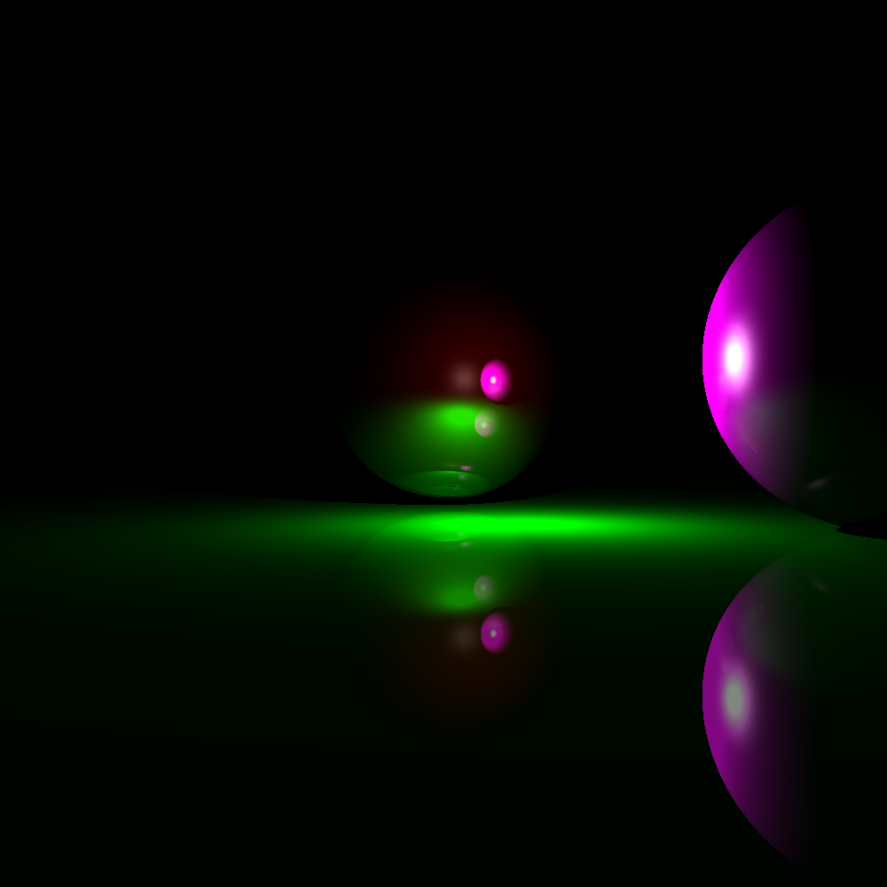

# Authors

- Zachariah Derrick
- Dylan Motz

# Usage

In order to use this program, first build the executable using the Makefile. This will allow you to generate a P3 ppm file from a scene file containing objects, formatted like so:

```
camera, width: 1, height: 1
sphere, radius: 2.0, reflectivity: 0.9, diffuse_color: [1, 0, 0], specular_color: [1, 1, 1], position: [0, 1, -15]
sphere, radius: 2.0, reflectivity: 0.2, diffuse_color: [1, 0, 1], specular_color: [1, 1, 1], position: [5, 1, -10]
plane, normal: [0, 1, 0], reflectivity: 0.5, diffuse_color: [0, 1, 0], position: [0, -1, 0]
light, color: [2, 2, 2], theta: 0, radial-a2: 0.125, radial-a1: 0.125, radial-a0: 0.125, position: [1, 1, -11]
```

To build the ppm file, use the following format:

```sh
./raytrace.exe width height input.scene output.ppm

Example run:

./raytrace.exe 1000 1000 scenes/example.scene images/example.ppm
```

With the example scene shown above, run by the example command above, the following image should be produced:



# Known Issues

No known issues